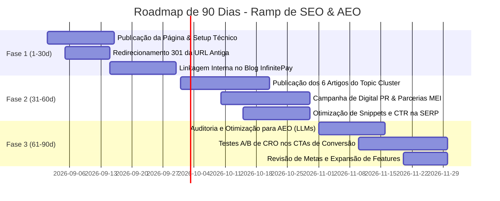

# Relatório Estratégico: Lançamento de Ferramenta Gratuita para Growth SEO/AEO
**Candidato:** Growth Marketing Specialist (Case Study InfinitePay)  
**Data:** 19 de Agosto de 2026

---

## 1. Resumo Executivo & Contexto do Desafio

* **Missão**: Acelerar a aquisição orgânica de novos clientes para a **InfinitePay** através do desenvolvimento e posicionamento de uma ferramenta gratuita de alta utilidade.
* **Oportunidade Escolhida**: **Calculadora de Margem de Lucro e Precificação de Produtos**.
* **Público-Alvo (ICP)**: Micro e pequenos empreendedores (MEIs, lojistas, prestadores de serviços e comerciantes de varejo/e-commerce) no momento exato em que estão definindo seus preços de venda e calculando seus custos operacionais.
* **Fit com o Ecossistema InfinitePay**: A precificação exige que o comerciante calcule as **taxas de intermediação de pagamento** (maquininhas, Pix e links). A ferramenta simula em tempo real a economia obtida ao utilizar os produtos da InfinitePay (InfiniteTap, InfiniteSmart, Link de Pagamento e Conta PJ), transformando uma busca informativa em uma conversão comercial direta.

---

## 2. Análise do Dataset do Ahrefs e Racional da Escolha

Avaliamos os três relatórios consolidados de mercado brasileiro dos últimos 6 meses fornecidos na pasta `dataset/`:
1. `organic-competitors.csv` (14 domínios concorrentes monitorados)
2. `top-pages.csv` (406 URLs de maior tráfego)
3. `organic-keywords.csv` (409 palavras-chave rastreadas)

### 2.1. O que consideramos e descartamos (e por quê)

Para encontrar a ferramenta ideal, filtramos o dataset cruzando três pilares: **Volume de Busca**, **Dificuldade de Rankeamento (KD)** e **Fit com o Negócio (Qualificação do Lead)**.

| Oportunidade Avaliada | Dados no Dataset | Diagnóstico | Decisão & Por quê |
| :--- | :--- | :--- | :--- |
| **Calculadora de Salário Líquido / Férias / CLT** | • Termo: `calculadora salario liquido` • Volume: **89.000 buscas/mês** • Tráfego Concorrente: 172.192 visitas no `dinheirocerto.com.br` (*Linha 4 de competitors / Linha 2 de top-pages*) | Atrai tráfego em massa, mas é focado em trabalhadores CLT e funcionários com carteira assinada. | **DESCARTADO**: **Zero fit com o ICP**. A InfinitePay vende soluções para quem *recebe pagamentos* (empresas/MEIs), não para quem recebe salário como pessoa física. |
| **Geradores de Senhas / CPF / Utilitários Genéricos** | • Alto volume disperso em ferramentas gratuitas de utilidades no `dinheirocerto.com.br` | Tráfego com baixíssima intenção comercial e sem retenção. | **DESCARTADO**: Tráfego "desperdiçado" que geraria custo de servidor sem nenhuma tração de novos clientes ou contas PJ. |
| **Calculadora de Taxas de Maquininha** | • URL atual: `/materiais/calculadora-de-taxas` • Tráfego Atual: **22 visitas/mês** (*Linha 296 de top-pages.csv*) | Intenção ultra comercial, mas dominada por termos de alta concorrência direta de concorrentes como `pagsfera.com.br` (DR 66). | **DESCARTADO COMO FERRAMENTA PRINCIPAL**: A página atual já existe e está estagnada. O usuário que busca isso já está no fundo de funil, enquanto precisamos capturar o cliente no topo/meio de funil antes de ele escolher a maquininha. |

---

### 2.2. A Oportunidade Escolhida: Calculadora de Margem e Precificação

Identificamos um **cluster de alto volume, baixa dificuldade (KD baixo) e grande brecha competitiva** no mercado de precificação:

#### Evidências no Dataset (`organic-keywords.csv` e `top-pages.csv`):
* `precificacao`: **14.800 buscas/mês** | **KD 7** | CPC $0.35 (*Linha 47 de organic-keywords.csv*)
* `markup`: **9.900 buscas/mês** | **KD 3** | CPC $0.02 (*Linha 42 de organic-keywords.csv*)
* `como precificar um produto`: **4.100 buscas/mês** | **KD 2** | CPC $0.10 (*Linha 61 de organic-keywords.csv*)
* `precificacao de produtos`: **3.900 buscas/mês** | **KD 4** | CPC $0.25 (*Linha 81 de organic-keywords.csv*)
* `margem de lucro`: **3.300 buscas/mês** | **KD 8** | CPC $0.01 (*Linha 149 de organic-keywords.csv*)
* `margem de contribuicao`: **2.400 buscas/mês** | **KD 9** | CPC $0.12 (*Linha 140 de organic-keywords.csv*)
* `como calcular lucro de um produto`: **1.900 buscas/mês** | **KD 10** | CPC $0.05 (*Linha 204 de organic-keywords.csv*)
* `como calcular margem de lucro`: **1.700 buscas/mês** | **KD 5** | CPC $0.02 (*Linha 144 de organic-keywords.csv*)
* `como calcular preco de venda`: **880 buscas/mês** | **KD 6** | CPC $0.07 (*Linha 151 de organic-keywords.csv*)
* `como dar desconto sem perder lucro`: **340 buscas/mês** | **KD 6** | CPC $0.08 (*Linha 252 de organic-keywords.csv*)
* `calculadora de margem`: **320 buscas/mês** | **KD 13** | CPC $0.02 (*Linha 392 de top-pages.csv*)

> **Volume Total Combinado do Cluster:** Mais de **50.000 buscas mensais** no Brasil com média de KD inferior a 8.

#### A Brecha Competitiva (A Grande Oportunidade):
1. **Concorrentes usam apenas texto estático**: Os líderes atuais dessas palavras-chave (`giroloja.com.br` com a URL `/blog/como-precificar-um-produto` e `lojafacil.com.br` com `/blog/precificacao-o-que-e`) rankeiam apenas com artigos longos e estáticos em blogs. Não oferecem uma ferramenta interativa e imediata.
2. **Subaproveitamento Atual da InfinitePay**: O domínio `infinitepay.io` já possui a URL `/materiais/calculadora-de-margem`, mas ela está na **posição 67** com **tráfego orgânico zerado** (*Linha 392 de top-pages.csv*). Isso prova que a intenção do usuário não está sendo atendida pela página antiga.
3. **Poder do Domínio InfinitePay**: A InfinitePay possui **Domain Rating (DR) 68**, superando os concorrentes que rankeiam no topo desse nicho (`giroloja.com.br` tem DR 38 e `lojafacil.com.br` tem DR 54). Com uma página técnica de alta velocidade e experiência interativa, a InfinitePay tem facilidade para assumir o **Top 1 do Google**.

---

## 3. Fit de Negócio: Integração com Produtos e Taxas Reais da InfinitePay

A precificação de um produto é composta por:
$$\text{Preço de Venda} = \text{Custo de Aquisição} + \text{Despesas Operacionais} + \text{Margem de Lucro} + \mathbf{Taxas\ de\ Meios\ de\ Pagamento}$$

Ao digitar suas despesas, o empreendedor percebe que as **taxas de maquininha e cartão impactam diretamente o seu lucro líquido**. Apresentamos a tabela de soluções reais da InfinitePay diretamente vinculada à ferramenta:

### 3.1. Matriz de Produtos, Taxas e Ganchos de Conversão

| Produto InfinitePay | Modalidade / Custo | Taxas Reais de Operação | Prazo | Aplicação Prática na Ferramenta / CTA |
| :--- | :--- | :--- | :--- | :--- |
| **InfiniteTap** *(Venda no Celular)* | • **R$ 0,00 de adesão** • **R$ 0,00 de mensalidade** | • Débito: **0,75% a 1,38%** • Crédito 1x: **2,89% a 3,16%** • Parcelado 12x: **9,80% a 12,40%** | Na hora / 1 dia útil | **Gancho para MEIs e iniciantes:** "Venda no celular sem gastar nada com maquininha e mantenha sua margem de lucro alta." |
| **InfiniteSmart** *(Maquininha Física)* | • **Compra Única** • **Sem aluguel mensal** | • Débito: **0,75% a 1,38%** • Crédito 1x: **2,89% a 3,16%** • Parcelado 12x: **9,80% a 12,40%** | Na hora / 1 dia útil | **Gancho para lojas e balcões:** "Elimine aluguéis de R$ 80 a R$ 150/mês e economize até 40% nas taxas de cartão por venda." |
| **Link de Pagamento** | • **Sem taxa de adesão** • **Sem mensalidade** | • Pix: **0,00% (Grátis)** • Crédito 1x: **~3,20%** • Parcelado 12x: **~12,90%** | Na hora | **Gancho para vendas no WhatsApp e redes:** "Venda à distância com link seguro e repasse as taxas sem assustar o cliente." |
| **Conta Digital PJ** | • **100% Gratuita** • **Sem tarifa de manutenção** | • Pix ilimitado: **R$ 0,00** • TED/Transferências: **R$ 0,00** | Instantâneo | **Gancho de Gestão:** "Zere os custos bancários da sua empresa e receba suas vendas no mesmo dia." |
| **Rendimento de Saldo** | • **Sem custo** | Rende **100%+ do CDI** diariamente no saldo da conta PJ | Diário | **Gancho Financeiro:** "Faça o caixa das suas vendas render automaticamente mais que a poupança enquanto planeja seu estoque." |
| **Cartão InfiniteCard** | • **Sem anuidade** | **+1,5% de Cashback** em todas as compras | Imediato | **Gancho de Lucro Extra:** "Pague seus fornecedores no InfiniteCard e receba 1,5% do valor de volta na conta." |

---

## 4. O que o Dataset NÃO Permite Concluir (Limitações Críticas dos Dados)

Seguindo a boa prática de Growth analítico, destacamos as limitações do dataset do Ahrefs:

1. **Ausência de Métricas de Conversão e LTV**: O Ahrefs nos mostra volume de busca e tráfego estimado, mas não nos diz qual é a taxa de conversão em clientes pagantes ou o valor do ciclo de vida (LTV) gerado por cada palavra-chave.
2. **Amostra Reduzida e Fragmentada**: O relatório contém ~400 linhas consolidadas. Domínios consolidados possuem dezenas de milhares de palavras rankeando. Isso significa que termos de cauda longa (Long Tail) altamente específicos não estão mapeados no export.
3. **Falta de Sazonalidade Temporal**: O recorte cobre 6 meses agregados, ocultando oscilações de busca típicas de datas sazonais (como Black Friday, Natal, início de ano e viradas fiscais).
4. **Estimativa de Tráfego Imprecisa para Recursos Interativos**: O tráfego do Ahrefs é inferido a partir de taxas de clique padrão (CTR) da SERP orgânica. Calculadoras e ferramentas interativas costumam ter CTR muito superior à média quando ocupam Featured Snippets e rich elements.

---

## 5. Arquitetura da Solução e Estratégia Técnica da Página

A ferramenta foi desenhada e construída não apenas como um script de cálculo, mas como um **ativo completo de aquisição e conversão orgânica**.

### 5.1. Arquitetura de Informação (Hub & Spoke / Topic Cluster)
* **Página Pilar (Hub)**: `/ferramentas/calculadora-margem-lucro-precificacao` (A ferramenta interativa que centraliza a autoridade).
* **Páginas Satélites de Suporte (Blog Clusters)**:
  1. *O que é Markup e como aplicar o Markup Divisor no comércio* (`markup` - 9.900 buscas)
  2. *Markup vs Margem de Lucro: Qual a diferença e qual usar?* (`markup ou margem` - 390 buscas)
  3. *Margem de Contribuição: Como calcular e precificar corretamente* (`margem de contribuicao` - 2.400 buscas)
  4. *Como calcular o lucro real de um produto passo a passo* (`como calcular lucro de um produto` - 1.900 buscas)
  5. *Como dar desconto sem perder o lucro do seu produto* (`como dar desconto sem perder lucro` - 340 buscas)
  6. *CMV e Custos Fixos: Como calcular para não ter prejuízo* (Guia de estruturação de custos)

### 5.2. Otimizações de SEO On-Page e AEO (Otimização para Motores de IA)
* **Semântica HTML5**: Uso rigoroso de `<header>`, `<main>`, `<section>`, `<article>`, `<h1>`, `<h2>`, `<fieldset>` e `<legend>`, facilitando a leitura por crawlers e leitores de tela.
* **Core Web Vitals Impecáveis**: Desenvolvida em Vanilla HTML, CSS e JavaScript sem dependência de bibliotecas pesadas. Carregamento instantâneo (< 0.5s), First Contentful Paint imediato e Zero Cumulative Layout Shift (CLS).
* **Dados Estruturados Schema.org**:
  - `WebApplication`: Permite que o Google reconheça a página como um aplicativo interativo e exiba snippets avançados.
  - `FAQPage`: Perguntas e respostas formatadas para capturar espaço na SERP e alimentar buscas por IA (Gemini, ChatGPT Search, Perplexity).
* **Respostas em Blocos AEO (Answer Engine Optimization)**: Textos e definições com respostas concisas de até 250 caracteres no topo das seções explicativas, aumentando a probabilidade de citação direta em resumos de Inteligência Artificial.

---

## 6. Roadmap de SEO e AEO para os Primeiros 90 Dias

Para transformar a ferramenta em um canal recorrente de aquisição, executaremos o plano em 3 etapas de 30 dias:

### Fase 1 (Dias 1 a 30): Fundação Técnica, Lançamento e Linkagem Interna
* **Ações**:
  - Deploy da página na URL `/ferramentas/calculadora-margem-lucro-precificacao`.
  - Configurar Redirect 301 de `/materiais/calculadora-de-margem` para a nova URL, herdando histórico e eliminando a URL antiga que estava em posição 67.
  - Inserir banners e links contextuais em todos os artigos de finanças e gestão do blog atual da InfinitePay apontando para a nova ferramenta.
* **Métricas de Sucesso**: 100% de indexação no Google Search Console; Core Web Vitals com pontuação > 95 no PageSpeed; Zero erros no teste de Schema JSON-LD.

### Fase 2 (Dias 31 a 60): Ativação de Topic Clusters e Link Building (Digital PR)
* **Ações**:
  - Publicação dos 6 artigos satélites no blog, interligados entre si e apontando para a calculadora interativa com âncoras exatas e contextuais.
  - Divulgação da ferramenta em portais de empreendedorismo, finanças e entidades de apoio a microempresas (ex: Sebrae, portais de contabilidade e MEIs).
* **Métricas de Sucesso**: Conquista de backlinks de ao menos 10 domínios com DR > 40; Entrada das palavras-chave secundárias no Top 10 da SERP.

### Fase 3 (Dias 61 a 90): Otimização para Motores de IA (AEO) e Otimização de Conversão (CRO)
* **Ações**:
  - Monitoramento de citações da ferramenta nas respostas do Gemini, Perplexity e ChatGPT.
  - Testes A/B nos botões de ação (CTA) para testar ofertas como "Vender no Celular com Taxa Zero" vs "Simular Maquininha InfiniteSmart".
* **Métricas de Sucesso**: Mais de 10.000 visitas orgânicas mensais; Taxa de conversão de visitantes em leads/aberturas de conta PJ acima de 4%.

---

## 7. Roteiro do Vídeo de Apresentação (Pitch de até 10 Minutos)

Guia prático para a gravação da apresentação para o Líder de Growth:

| Minutagem | Bloco do Vídeo | O que mostrar na tela | Mensagem Principal a Transmitir |
| :--- | :--- | :--- | :--- |
| **0:00 - 1:30** | **Abertura & O Desafio** | • Slide de apresentação ou visão geral do case | "O desafio era encontrar uma oportunidade de ferramenta gratuita para acelerar a aquisição orgânica da InfinitePay. Analisamos os dados do Ahrefs e encontramos uma oportunidade com fit perfeito." |
| **1:30 - 3:30** | **Os Dados do Ahrefs & A Brecha** | • Mostrar a planilha `organic-keywords.csv` nas linhas 47 (`precificacao` - 14.8k) e 42 (`markup` - 9.9k). • Mostrar a linha 392 de `top-pages.csv` com a posição 67 da URL antiga. | "O cluster de precificação soma mais de 50 mil buscas mensais com KD médio menor que 8. Os concorrentes usam apenas textos estáticos em blogs, enquanto a InfinitePay tinha uma página antiga sem tráfego. Com nosso DR 68, podemos dominar o Top 1." |
| **3:30 - 5:00** | **O Fit de Negócio com a InfinitePay** | • Exibir a matriz de produtos (InfiniteTap, InfiniteSmart, Link de Pagamento, Conta PJ e Rendimento CDI). | "Precificar um produto exige calcular as taxas do cartão. Na calculadora, o comerciante insere os custos e vê na hora como as menores taxas da InfinitePay aumentam seu lucro real no bolso." |
| **5:00 - 7:00** | **A Página & Simulação ao Vivo** | • Abrir o `index.html` no navegador. • Fazer simulação com Custo R$ 50, Despesas 15%, Margem 25% e taxa concorrente de 4,99%. | "A página é 100% responsiva, calcula preço de venda, markup, margem líquida e lucro em reais, exibindo em tempo real o comparador de economia com a InfinitePay." |
| **7:00 - 8:30** | **Estrutura Técnica de SEO & AEO** | • Inspecionar o código mostrando as meta tags, Schema `WebApplication` e `FAQPage`. | "A página foi desenhada para Core Web Vitals ultrarrápidos e estruturada com Schema.org para capturar Rich Snippets e ser citada por motores de busca baseados em IA como Gemini e ChatGPT." |
| **8:30 - 10:00** | **Roadmap de 90 Dias & Conclusão** | • Exibir o diagrama do Roadmap de 90 dias. | "Com 3 fases bem definidas (Fundação e 301, Clusters de Conteúdo + PR e AEO/CRO), nosso objetivo é atingir 10 mil visitas mensais e converter o tráfego em novos clientes para o ecossistema InfinitePay." |

---

## 8. Conclusão

A **Calculadora de Margem de Lucro e Precificação de Produtos** atende rigorosamente a todos os critérios estabelecidos pela liderança: fundamentação sólida e rastreável nos dados do Ahrefs, alta relevância para o cliente ideal da InfinitePay, diferenciação frente ao conteúdo estático dos concorrentes e um plano claro de ramp de SEO/AEO para os primeiros 90 dias.
